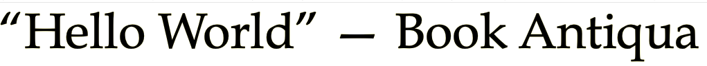
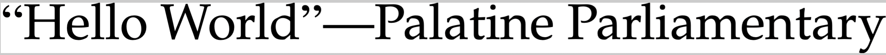

# Palatine Parliamentary
Typeset draft bills like a pro! (UK). 

## Executive Summary
For those who want to typeset in the style of UK legislation, I have created a clone of the Book Antiqua™ Parliamentary typeface used for the official publication of statutes.  Book Antiqua Parliamentary is not publicly available, but is known to be a custom blend of Book Antiqua™ and Times New Roman™  ; hence, I created this typeface with (legally) just such a blend.  It also fulfils the need for clearer punctuation marks than the default ones in Palatino™ (and similar); see, eg, [this StackExchange thread](https://tex.stackexchange.com/questions/359899/can-one-change-the-font-used-by-csquotes).

## Visual Demonstration

## Details

This font contains precisely one modification to the `newpx` font OTF files created by Michael Sharpe, which in turn are modified versions of TexGyrePagella (created by GUST and under their eponymous licence), which in even more turn, is a clone of Hermann Zapf's masterpiece (and here due credit must also go to his collaborator, the legendary punchcutter August Rosenberger), Palatino™ (aka Book Antiqua™). This modification   entailed the replacement of quotation marks (single and double) in TeX Gyre PagellaX with those of TeX Gyre TermesX (Michael Sharpe's modified version of GUST's clone of Times New Roman™), to  exactly replicate the 'Book Antiqua Parliamentary' typeface used in typing UK legislation, which was modified by Parliament along precisely the same lines as this typeface (ie Palatino™ mixed with Times New Roman™).  I then also expanded the coverage of Greek and Cyrillic with characters from D B Miller's Domitian typeface, just in case someone wants to type in Greek or Cyrillic, because why not. 

For the curious, I sent an FOI to Parliament regarding their own licensing of Book Antiqua™ and Times New Roman™; the courteous and prompt response was that they did not hold such information as their typeface had been created by a subcontractor.  Regardless, the public does know that Palatine Parliamentary typeface is legal, and that's enough for me. 

## Licensing

My alteration is is subject to the LaTeX Project Public License. See http://www.ctan.org/license/lppl1.3
for the details of that license.  

